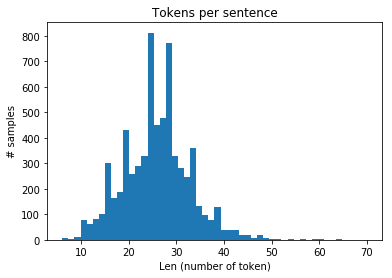
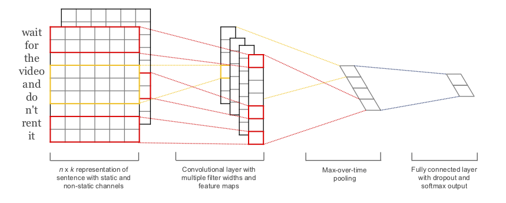

# Twitter Tweet Sentiment Analysis 
##### Udacity Machine Learning Engineer Nanodegree Capstone project

##### Sujay Bhowmick
8th August 2018

### Project Goal

In NLP sentiment analysis is the most common problems through which we try to infer the sentiment of sentence or a paragraph. 

The goal of this Machine Learning Nanodegree Capstone project is to analyse the sentiment of various twitter tweets which is publicly available.

The tweets are related to financial news which have been labelled by a human for training and testing purpose of the Machine Learning model. There are approximately 8000 tweets which have been labelled with labels **Positive** and **Negative** for tweets indicating a **Positive** sentiment and **Negative** sentiment respectively.

Further some preprocessing is performed on the raw tweets to remove certain punctuations, links, tweet handles and certain special characters.

### Data
Let's take a look at data. The labels are encoded in the dataset: **0** is for **Negative** and **1** for a **Positive** sentiment


```python
# Loading the preprocessed csv file into pandas and dropping the msg_id column

import pandas as pd
base_dir = "."
# Read the twitter data file csv
df = pd.read_csv(base_dir + "/preprocessed_tweets.csv", encoding='latin-1')
df = df.drop(columns=['msg_id'])
df
```


<div>
<style scoped>
    .dataframe tbody tr th:only-of-type {
        vertical-align: middle;
    }

    .dataframe tbody tr th {
        vertical-align: top;
    }
    
    .dataframe thead th {
        text-align: right;
    }
</style>
<table border="1" class="dataframe">
  <thead>
    <tr style="text-align: right;">
      <th></th>
      <th>content</th>
      <th>label</th>
    </tr>
  </thead>
  <tbody>
    <tr>
      <th>0</th>
      <td>boeing hit hard by tariff and trade war headl...</td>
      <td>0</td>
    </tr>
    <tr>
      <th>1</th>
      <td>&lt;NAME/&gt; &lt;HASHTAG/&gt; microsoft is a proud spons...</td>
      <td>1</td>
    </tr>
    <tr>
      <th>2</th>
      <td>&lt;NAME/&gt; &lt;NAME/&gt; it 's not fake news , i own b...</td>
      <td>1</td>
    </tr>
    <tr>
      <th>3</th>
      <td>&lt;NAME/&gt; canada should consider slapping 300% ...</td>
      <td>0</td>
    </tr>
    <tr>
      <th>4</th>
      <td>'upwards of 20 , 00 workers' could lose jobs ...</td>
      <td>0</td>
    </tr>
    <tr>
      <th>5</th>
      <td>$tsla short interest: 28 , 382 , 800 vs prev ...</td>
      <td>1</td>
    </tr>
    <tr>
      <th>6</th>
      <td>the most logical way-forward for &lt;HASHTAG/&gt; s...</td>
      <td>0</td>
    </tr>
    <tr>
      <th>7</th>
      <td>&lt;NAME/&gt; &lt;NAME/&gt; or could lead to a monopoly w...</td>
      <td>1</td>
    </tr>
    <tr>
      <th>8</th>
      <td>we need to break up google , disney , and eve...</td>
      <td>0</td>
    </tr>
    <tr>
      <th>9</th>
      <td>venkatesh potluri , a research fellow at micr...</td>
      <td>1</td>
    </tr>
    <tr>
      <th>10</th>
      <td>venkatesh potluri , a research fellow at micr...</td>
      <td>1</td>
    </tr>
    <tr>
      <th>11</th>
      <td>veolia teams mobilized to restore &lt;HASHTAG/&gt; ...</td>
      <td>1</td>
    </tr>
    <tr>
      <th>12</th>
      <td>favoring insider deal , beach leaders \( town...</td>
      <td>0</td>
    </tr>
    <tr>
      <th>13</th>
      <td>insider trade update: jarl berntzen increases...</td>
      <td>1</td>
    </tr>
    <tr>
      <th>14</th>
      <td>investigate salesforce insider trading crime ...</td>
      <td>0</td>
    </tr>
    <tr>
      <th>15</th>
      <td>&lt;NAME/&gt; &lt;NAME/&gt; &lt;HASHTAG/&gt; podcast: avaya to ...</td>
      <td>1</td>
    </tr>
    <tr>
      <th>16</th>
      <td>&lt;HASHTAG/&gt; breakingnews &lt;HASHTAG/&gt; tech magic...</td>
      <td>1</td>
    </tr>
    <tr>
      <th>17</th>
      <td>rt &lt;NAME/&gt; ironic that freeport mcmoran is th...</td>
      <td>1</td>
    </tr>
    <tr>
      <th>18</th>
      <td>rt &lt;NAME/&gt; exciting to hear that my companyêl...</td>
      <td>1</td>
    </tr>
    <tr>
      <th>19</th>
      <td>not great reading for waitrose , heading in t...</td>
      <td>0</td>
    </tr>
    <tr>
      <th>20</th>
      <td>fitbit 's looking for a sweet turnaround - th...</td>
      <td>1</td>
    </tr>
    <tr>
      <th>21</th>
      <td>kimberly-clark wins 2018 climate leadership a...</td>
      <td>1</td>
    </tr>
    <tr>
      <th>22</th>
      <td>per wsj , unilever threatens removing adverti...</td>
      <td>0</td>
    </tr>
    <tr>
      <th>23</th>
      <td>unilever calls out facebook/google sexism , r...</td>
      <td>0</td>
    </tr>
    <tr>
      <th>24</th>
      <td>coffee 's on: 41st street starbucks reopens a...</td>
      <td>1</td>
    </tr>
    <tr>
      <th>25</th>
      <td>experts: "starbucks ceo schultz 's hiring of ...</td>
      <td>0</td>
    </tr>
    <tr>
      <th>26</th>
      <td>datacentrix takes top honours at 2017 hpe par...</td>
      <td>1</td>
    </tr>
    <tr>
      <th>27</th>
      <td>mcdonald 's , hedging their bets , under-orde...</td>
      <td>0</td>
    </tr>
    <tr>
      <th>28</th>
      <td>rt &lt;NAME/&gt; arby 's buys buffalo wild wings , ...</td>
      <td>0</td>
    </tr>
    <tr>
      <th>29</th>
      <td>rt &lt;NAME/&gt; due to the forecasted heavy snow ,...</td>
      <td>0</td>
    </tr>
    <tr>
      <th>...</th>
      <td>...</td>
      <td>...</td>
    </tr>
    <tr>
      <th>8321</th>
      <td>abbvie 's hepatitis c drug , novartis' lung c...</td>
      <td>1</td>
    </tr>
    <tr>
      <th>8322</th>
      <td>abbvie 's hepatitis c drug , novartis' lung c...</td>
      <td>1</td>
    </tr>
    <tr>
      <th>8323</th>
      <td>vw must recall around 57 , 600 of its diesel ...</td>
      <td>0</td>
    </tr>
    <tr>
      <th>8324</th>
      <td>multiple &lt;HASHTAG/&gt; myeloma study results enc...</td>
      <td>1</td>
    </tr>
    <tr>
      <th>8325</th>
      <td>"wpp teamed up with cambridge analytica to wo...</td>
      <td>1</td>
    </tr>
    <tr>
      <th>8326</th>
      <td>ingram micro expands cybersecurity capabiliti...</td>
      <td>1</td>
    </tr>
    <tr>
      <th>8327</th>
      <td>branded a liar \? – the &lt;HASHTAG/&gt; volkswagen...</td>
      <td>0</td>
    </tr>
    <tr>
      <th>8328</th>
      <td>our collaboration with the johnson &amp; johnson ...</td>
      <td>1</td>
    </tr>
    <tr>
      <th>8329</th>
      <td>looking to become a &lt;HASHTAG/&gt; pinterest rock...</td>
      <td>1</td>
    </tr>
    <tr>
      <th>8330</th>
      <td>the immoral minority: pepsico reserves one hu...</td>
      <td>1</td>
    </tr>
    <tr>
      <th>8331</th>
      <td>&lt;NAME/&gt; source says the layoff wo n't include...</td>
      <td>0</td>
    </tr>
    <tr>
      <th>8332</th>
      <td>rt &lt;NAME/&gt; breaking: british members of parli...</td>
      <td>0</td>
    </tr>
    <tr>
      <th>8333</th>
      <td>$carb: carbonite paying $145m to buy dell sub...</td>
      <td>1</td>
    </tr>
    <tr>
      <th>8334</th>
      <td>rt &lt;NAME/&gt; netflix acquires sundance award-wi...</td>
      <td>1</td>
    </tr>
    <tr>
      <th>8335</th>
      <td>&lt;NAME/&gt; &lt;HASHTAG/&gt; trump gave special permits...</td>
      <td>0</td>
    </tr>
    <tr>
      <th>8336</th>
      <td>rt &lt;NAME/&gt; &lt;HASHTAG/&gt; aadhaar identity fraud ...</td>
      <td>0</td>
    </tr>
    <tr>
      <th>8337</th>
      <td>$amzn partnering w $jpm , berkshire hathaway ...</td>
      <td>1</td>
    </tr>
    <tr>
      <th>8338</th>
      <td>$amzn partnering w $jpm , berkshire hathaway ...</td>
      <td>1</td>
    </tr>
    <tr>
      <th>8339</th>
      <td>now this is truly disruptive. the spinoffs of...</td>
      <td>0</td>
    </tr>
    <tr>
      <th>8340</th>
      <td>now this is truly disruptive. the spinoffs of...</td>
      <td>0</td>
    </tr>
    <tr>
      <th>8341</th>
      <td>&lt;NAME/&gt; has warned customers to be cautious o...</td>
      <td>0</td>
    </tr>
    <tr>
      <th>8342</th>
      <td>stop illegal mass layoff in verizon: &lt;HASHTAG...</td>
      <td>0</td>
    </tr>
    <tr>
      <th>8343</th>
      <td>i will keep everyone posted as i find out mor...</td>
      <td>0</td>
    </tr>
    <tr>
      <th>8344</th>
      <td>rt &lt;NAME/&gt; we are excited &lt;NAME/&gt; to &lt;HASHTAG...</td>
      <td>1</td>
    </tr>
    <tr>
      <th>8345</th>
      <td>&lt;HASHTAG/&gt; rnaseq veracyte plans two new test...</td>
      <td>1</td>
    </tr>
    <tr>
      <th>8346</th>
      <td>rt &lt;NAME/&gt; how apple pay can make credit card...</td>
      <td>0</td>
    </tr>
    <tr>
      <th>8347</th>
      <td>globe , disney partner to support hero founda...</td>
      <td>1</td>
    </tr>
    <tr>
      <th>8348</th>
      <td>rt &lt;NAME/&gt; fantastic story of partnership wit...</td>
      <td>1</td>
    </tr>
    <tr>
      <th>8349</th>
      <td>messaging on net neutrality is all messed up....</td>
      <td>0</td>
    </tr>
    <tr>
      <th>8350</th>
      <td>messaging on net neutrality is all messed up....</td>
      <td>0</td>
    </tr>
  </tbody>
</table>
<p>8351 rows × 2 columns</p>
</div>


Split the tweet dataset into training and test datasets using sklearn's split function


```python
from sklearn.model_selection import train_test_split
train, test = train_test_split(df, test_size=0.2)
print(train.shape)
print(test.shape)
```

    (6680, 2)
    (1671, 2)


Use a custom tokenizer to understand the distribution of words in the tweets dataset. We see that the max length of the tweets is around 32


```python
import re
import string
import os
import matplotlib
import matplotlib.pyplot as plot
from keras.preprocessing.text import Tokenizer

# Tokenize
re_tok = re.compile(f'([{string.punctuation}“”¨«»®´·º½¾¿¡§£₤‘’])')
def tokenize(s): return re_tok.sub(r' \1 ', s).split()
# Plot 
plot.hist([len(tokenize(s)) for s in train['content'].values], bins=50)
plot.title('Tokens per sentence')
plot.xlabel('Len (number of token)')
plot.ylabel('# samples')
plot.show()
```





### Training Parameters (Hyper Parameters)
We'll set the following hyperparameters for training our model.
The above token per word plot, is used to determine the MAX_LEN which is according to plot is 22


```python
# Number of examples used in each iteration
BATCH_SIZE = 32 
# Size of vocabulary dictionary
VOCAB_SIZE = 30000
# Max length of tweet as per the plot above
MAX_LEN = 22
# Dimension of word embedding vector
EMBEDDING_DIM = 40
```

### Preprocessing

Before using the data for the model, we need to preprocess the tweet content. For this purpose we will use Keras Tokenizer to convert each word into a corresponding integer identifier. In order for us to use the content in the Model we must ensure the length of the content is same. We can do this by using the Keras **sequence.pad_sequences** function. All content greater than MAX_LEN will be truncated and text which are less than MAX_LEN will be padded to get the same length


```python
from keras.preprocessing import sequence
from keras.models import Sequential
from keras.layers import Dense, Embedding, GlobalMaxPooling1D, Flatten, Conv1D, Dropout, Activation
from keras.preprocessing.text import Tokenizer

import tensorflow as tf
import numpy as np

from tensorflow import set_random_seed
from numpy.random import seed

seed(1)
set_random_seed(2)

tweet_tokenizer = Tokenizer(num_words=VOCAB_SIZE)
tweet_tokenizer.fit_on_texts(train['content'].values)

x_train_seq = tweet_tokenizer.texts_to_sequences(train['content'].values)
x_test_seq = tweet_tokenizer.texts_to_sequences(test['content'].values)

x_train = sequence.pad_sequences(x_train_seq, maxlen=MAX_LEN, padding="post", value=0)
x_test = sequence.pad_sequences(x_test_seq, maxlen=MAX_LEN, padding="post", value=0)

y_train, y_test = train['label'].values, test['label'].values

print('First sample before preprocessing: \n', train['content'].values[0], '\n')
print('First sample after preprocessing: \n', x_train[0])
```

    First sample before preprocessing: 
      rt <NAME/> <HASHTAG/> ictsi is profiting off exploiting workers , crippling communities and supporting dictatorships. <NAME/> is this a reputé 
    
    First sample after preprocessing: 
     [  12    2    3 8151   11 5196   70 3085  233 8152 2576    8 3086 8153
        2   11   23    9 8154    0    0    0]


### Model Architecture
I have used a model based on Kim Yoon’s [Convolutional Neural Networks for Sentence Classification.](https://arxiv.org/abs/1408.5882)




```python
# CNN Model

NUM_FILTERS = 250
KERNEL_SIZE = 3
HIDDEN_DIMS = 250

print('Build model...')
model = Sequential()

# We use embedding layer which maps our vocabulary indices into EMBEDDING_DIM dimensions
model.add(Embedding(VOCAB_SIZE, EMBEDDING_DIM, input_length=MAX_LEN))
model.add(Dropout(0.2))

# Adding Convolution1D
model.add(Conv1D(NUM_FILTERS,
                 KERNEL_SIZE,
                 padding='valid',
                 activation='relu',
                 strides=1))

# Add a max pooling:
model.add(GlobalMaxPooling1D())

# Add a simple hidden layer:
model.add(Dense(HIDDEN_DIMS))
model.add(Dropout(0.2))
model.add(Activation('relu'))

# We project onto a single unit output layer, and use sigmoid function
model.add(Dense(1))
model.add(Activation('sigmoid'))
model.compile(loss='binary_crossentropy', optimizer='adam', metrics=['accuracy'])
model.summary()
```

    Build model...
    _________________________________________________________________
    Layer (type)                 Output Shape              Param #   
    =================================================================
    embedding_44 (Embedding)     (None, 22, 40)            1200000   
    _________________________________________________________________
    dropout_87 (Dropout)         (None, 22, 40)            0         
    _________________________________________________________________
    conv1d_44 (Conv1D)           (None, 20, 250)           30250     
    _________________________________________________________________
    global_max_pooling1d_44 (Glo (None, 250)               0         
    _________________________________________________________________
    dense_87 (Dense)             (None, 250)               62750     
    _________________________________________________________________
    dropout_88 (Dropout)         (None, 250)               0         
    _________________________________________________________________
    activation_87 (Activation)   (None, 250)               0         
    _________________________________________________________________
    dense_88 (Dense)             (None, 1)                 251       
    _________________________________________________________________
    activation_88 (Activation)   (None, 1)                 0         
    =================================================================
    Total params: 1,293,251
    Trainable params: 1,293,251
    Non-trainable params: 0
    _________________________________________________________________


### Train and Evaluate


```python
EPOCHS = 2 # Number of passes through entire dataset
model.fit(x_train, y_train,
          batch_size=BATCH_SIZE,
          epochs=EPOCHS,
          validation_split=0.1)

# Evaluate the model
score, acc = model.evaluate(x_test, y_test, batch_size=BATCH_SIZE)
print('\nAccuracy: ', acc*100)

pred = model.predict_classes(x_test)
```

    Train on 6012 samples, validate on 668 samples
    Epoch 1/2
    6012/6012 [==============================] - 7s 1ms/step - loss: 0.5976 - acc: 0.6575 - val_loss: 0.4662 - val_acc: 0.7814
    Epoch 2/2
    6012/6012 [==============================] - 4s 592us/step - loss: 0.2762 - acc: 0.8891 - val_loss: 0.5051 - val_acc: 0.7874
    1671/1671 [==============================] - 0s 91us/step
    
    Accuracy:  79.83243567083211


### Test the Model we just trained


```python
SENTIMENT_LABELS = ['negative', 'positive']
def predict(tweet):
    # Preprocessing step
    tweet_words_array = tweet_tokenizer.texts_to_sequences([tweet])
    tweet_words_array = sequence.pad_sequences(tweet_words_array, maxlen=MAX_LEN, padding="post", value=0)
    
    #Predict the sentiment label and score
    score = model.predict(tweet_words_array)[0][0]
    prediction = SENTIMENT_LABELS[model.predict_classes(tweet_words_array)[0][0]]
    print('Tweet:', tweet, '\nPrediction:', prediction, '\nScore: ', score)
    print('\n')

predict(". RT @SpryGuy: The CEO of Papa John's stiffs and cheats his own employees so he can live in this castle with a moat. NEVER buy Papa John's pi…")
predict(". GVC Holdings consummated the acquisition of Ladbrokes Coral https://t.co/xaN4ACA0h6 https://t.co/ZNm0gmXLK7")
predict(". family fully prepared to drop Roku, Apple iPhones , Amazon Prime, toss out Alexa,Google emails chromes, etc in the… https://t.co/64cZYuhYSQ")
predict(". #AtlasMara holding is a real ingenious feat in The financial fraternity..am amazed at the forge ahead they posses.. #mindblown")
predict(". Boeing hit hard by tariff and trade war headlines today, down -3.5%. Also note the very ugly price/momentum diverge https://t.co/h9bfT95yWZ")
```

    Tweet: . RT @SpryGuy: The CEO of Papa John's stiffs and cheats his own employees so he can live in this castle with a moat. NEVER buy Papa John's pi… 
    Prediction: negative 
    Score:  0.15090017

​    

Tweet: . GVC Holdings consummated the acquisition of Ladbrokes Coral https://t.co/xaN4ACA0h6 https://t.co/ZNm0gmXLK7 

Prediction: positive 

Score:  0.6433192

Tweet: . family fully prepared to drop Roku, Apple iPhones , Amazon Prime, toss out Alexa,Google emails chromes, etc in the… https://t.co/64cZYuhYSQ 

Prediction: negative 

Score:  0.05211673

Tweet: . #AtlasMara holding is a real ingenious feat in The financial fraternity..am amazed at the forge ahead they posses.. #mindblown 

Prediction: positive 

Score:  0.9745812

Tweet: . Boeing hit hard by tariff and trade war headlines today, down -3.5%. Also note the very ugly price/momentum diverge https://t.co/h9bfT95yWZ 

Prediction: negative 

Score:  0.23086311


​    


### Save Model


```python
# Save model
model.save_weights('models/cnn_twitter_sentiment_weights.h5')
```
